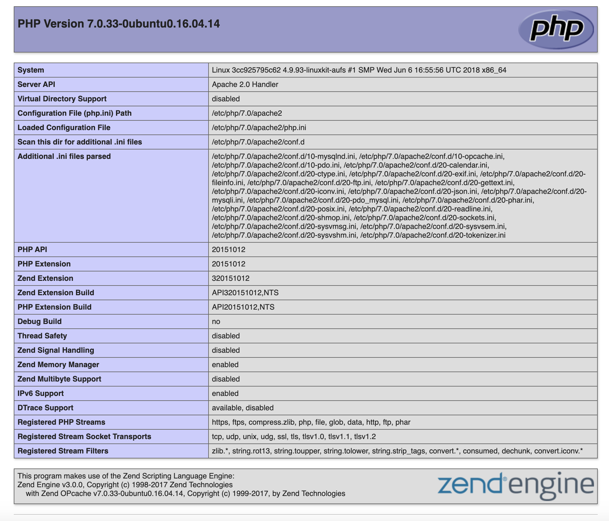

## Containerize apache and PHP within Docker



### steps to run
- Step1 : Clone repo
```sh
git clone https://github.com/haritkumar/containerize-apache-php-docker.git
cd containerize-apache-php-docker
```

- Step 2 : Build docker image 
```sh
sh build.sh
```

- Step 3 : Run docker image
```sh
docker run -p 8080:80 haritkumar/apache-php-7.0
```

- Step 4 : Access site

`http://localhost:8080/`

#### Start container in interactive mode
```sh
docker run -i -t -p 8080:80 haritkumar/apache-php-7.0 /bin/bash
```

#### Mount a directory from the host into the container
```sh
docker run -p 8080:80 -d -v /opt/site:/var/www/site haritkumar/apache-php-7.0
```